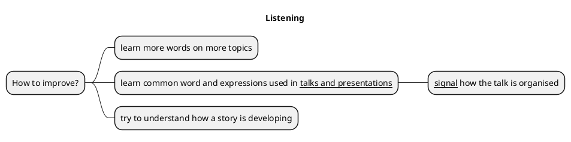
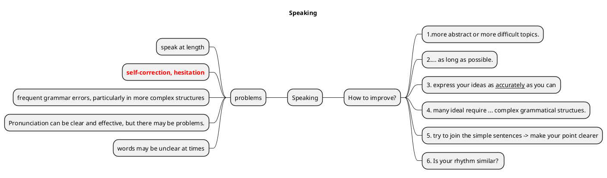
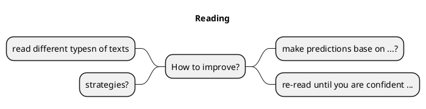
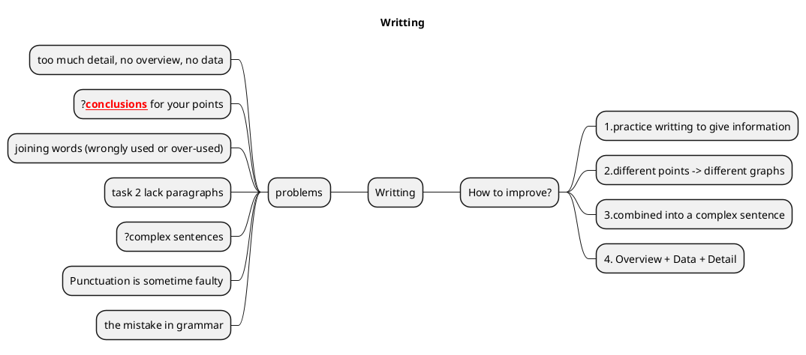

# 1. Current Status
## 1.1) Previous score
### Listening: 5.0
Test takers at Band 5 can typically listen to and process short stretches of speech to <ins>pick out</ins> discrete information, and can only somewhat follow detailed instructions. They can only understand directly-stated facts, attitudes, opinions and purposes in a limited way. They are also limited in their ability to pick out main ideas and infer implied meanings. In order to do this, they can keep short sections of what they have heard in their short-term memory. They can understand vocabulary relating to familiar and some less familiar topics.

>How to improve:
Continue learning more words on more topics. In addition, learn common words and expressions used in talks and presentations to signal <ins>how the talk is organised</ins>. Listen regularly to authentic recordings and video clips on TV or the internet. Use the subtitles to help you if needed. Beyond main ideas and specific details, try to understand the relationship of one speaker’s ideas to another speaker’s ideas, or <ins>how a story is developing</ins>. Use the clues contained in the language they use.

### Speaking: 6.5

Test takers at this band can typically speak at length, although they are sometimes less clear or fluent because of repetition, self-correction, or hesitation to search for words or grammar. Speaking is generally well-organised, and ideas are generally well linked, but with some errors. They have enough vocabulary to discuss topics clearly and at length, although there are often errors, and they can usually paraphrase well. They can use simple and complex grammar structures but with limited range. There may be frequent grammar errors, particularly in more complex structures, but language is usually easy to understand. Pronunciation can be clear and effective, but there may be problems. They are usually easy to understand, although words may be unclear at times.

>How to improve:
Talk to other English speakers about more abstract topics or more difficult current topics. Keep the discussion going for as long as possible. At the same time, try to express your ideas as accurately as you can, using the best words you know. Many of your ideas will also require the use of complex grammatical structures. If you’re using several simple sentences, try to join them up in a way that makes your point clearer. Listen (and read) in English more to help you pick up natural and idiomatic phrases. When listening, note the rhythm and also the words that the speaker stresses. Is your rhythm similar? Are you putting the stress on the right words?

### Reading: 5.5

Test takers at Band 5 typically deal reasonably well with straightforward factual and opinion-based texts. They are able to use their vocabulary knowledge to create meaning, but mostly within sentences rather than across sentences. They can understand directly stated information, opinions and arguments, and some implied meanings. They are generally able to extract key words from texts, and have a limited ability to synthesize concrete information and make inferences.

>How to improve:
Try to read different types of texts, including some academic ones in your subject area. When reading, use different <ins>strategies</ins> to help you. For example, decide which parts need to be read carefully and which parts can be read more quickly or not at all. You can also try to make predictions based on the title or what you have already read, or guess the meaning using surrounding words and sentences. Re-read until you are confident that you understand the opinions and arguments. You might also want to identify the clues that tell you about important points, what the writer’s attitude to the topic is, or where the writer is moving on to a different point.

### Writing: 5.5
Test takers at this band are typically able to partly answer the question. There may be too much detail and no overview, or no data. Test takers can give their own point of view and some main ideas, although these may not lead to any conclusions. They can partly organise their writing, and can use some joining words, although these are wrongly used or over-used in places. The writing might repeat itself and the Task 2 might lack paragraphs. They have just enough vocabulary to answer the question, although spelling mistakes cause some difficulty for the reader. They are able to use some basic sentences correctly, and try some complex sentences, which often contain mistakes. Punctuation is sometimes faulty and the mistakes in grammar cause some difficulty for the reader.

>How to improve:
Practice writing to give information. Try writing a one sentence summary of the points you want to make. A good summary sentence at the beginning of your work can help the reader know what's coming, making your work easier to read. Then, go through your points one by one. Put different points in different paragraphs, to make them easier to follow. Don't forget that letters, reports and essays are different, so make sure your writing matches what you're being asked to write. After you produce a piece of writing, see if there are sentences next to each other that can be combined into a complex sentence. If you're referring to something frequently, try to refer to it in different ways. This can often make your writing flow better. Check your spelling to make sure they are correct.

## 1.2) Current Date:
[//]: # (- 7th June 2024)

# 2. Experience
## 2.1) Listening
## 2.2) Speaking
## 2.3) Reading
## 2.4) Writing

# 3. Target
## 3.1) Listening
## 3.2) Speaking
## 3.3) Reading
## 3.4) Writing

